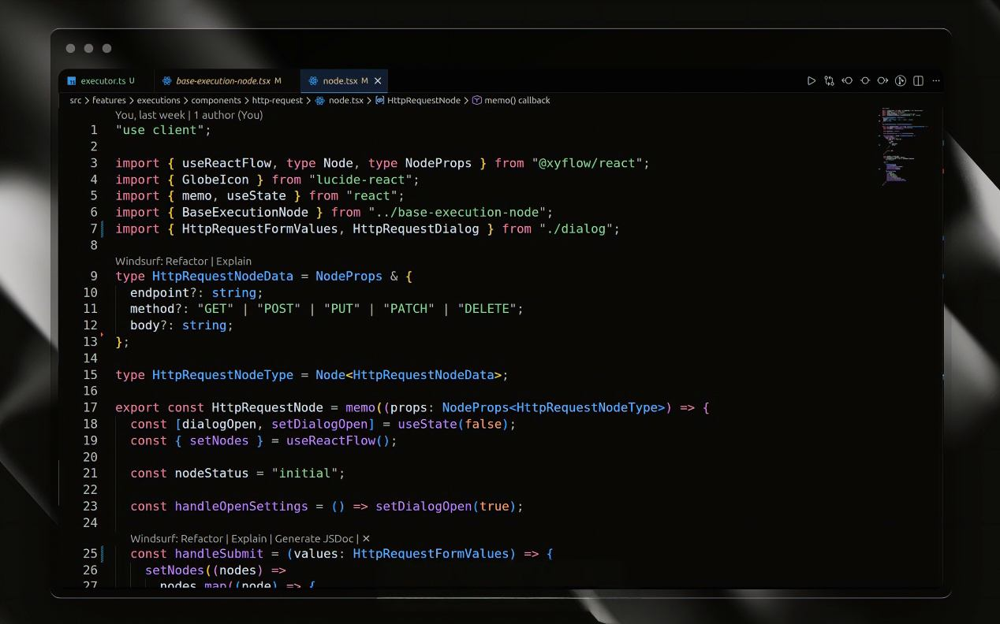

# Next Horizon Theme

## Preview

Next Horizon is a clean, modern dark theme inspired by the Next.js design language.  
It focuses on clarity, balanced contrast, and subtle accents to create a calm and productive coding environment—ideal for long development sessions.

---

## Recommended Settings & Extensions

For the best visual experience, we recommend using the following settings in your `settings.json`:

```json
{
  "editor.fontFamily": "'SF Mono', 'Fira Code', monospace",
  "editor.fontSize": 16,
  "editor.cursorSmoothCaretAnimation": "on"
}
```

### Recommended Extensions

For optimal syntax highlighting when working with modern web stacks, we recommend:

- **vscode-styled-components** – improved highlighting for styled-components
- **ES7+ React/Redux Snippets** – enhanced React & JSX support

---

## About

Next Horizon is crafted with a focus on modern frontend development, drawing inspiration from the clean aesthetics and thoughtful color usage found in the Next.js ecosystem.

The theme prioritizes:

- Readability over decoration
- Subtle contrast over harsh colors
- Consistency across UI, syntax, and terminal

Designed to feel professional, minimal, and comfortable.

---

## Installation

### VS Code Marketplace

1. Open **Visual Studio Code**
2. Go to **Extensions** (`Ctrl+Shift+X` / `Cmd+Shift+X`)
3. Search for **Next Horizon Theme**
4. Click **Install**
5. Activate it via `Ctrl+K Ctrl+T` / `Cmd+K Cmd+T`

Or install directly from the [VS Code Marketplace](https://marketplace.visualstudio.com/items?itemName=pankajghosh.next-horizon).

---

### Open VSX

For editors that use the **Open VSX Registry** (VSCodium, Fleet, Windsurf, etc.) or for manual installation:

1. Download the `.vsix` file
2. Open your editor’s Extensions view
3. Choose **Install from VSIX**
4. Select the downloaded file

---

## Feedback & Contributions

If you encounter any issues or have suggestions, feel free to open an issue or contribute:

👉 [https://github.com/iampankajghosh/next-horizon](https://github.com/iampankajghosh/next-horizon)

---

## Version

Current version: **0.2.0**

See [CHANGELOG.md](./CHANGELOG.md) for version history and updates.

---

## License

This theme is licensed under the [MIT License](./LICENSE).

---

Enjoy coding with **Next Horizon** 🌌
